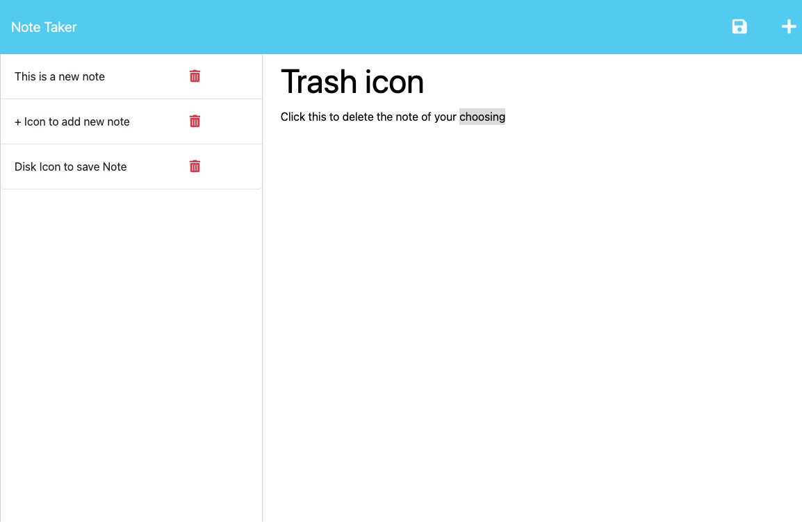

# Taylor's Note Taker 

## Table of Contents
- [Description](#description)
- [Installation](#installation)
- [Usage](#usage)
- [License](#license)
- [Contributing](#contributing)
- [Tests](#tests)
- [Questions](#questions)

## Description
This is a simple note taking app that lets you add notes to a json file. It also allows you to delete notes.  This was a Project that helped me understand routes a little better as well as the importance of modularization. I am using Express.js to deal with the api calls and routes.

## Installation
simply visit the link to the deployed site https://taylors-note-taking-app-301b8f6019ba.herokuapp.com/notes

## Usage
When you have launched the site click on get started, this will take you to the notes page.  Start by editing the title and note text, once you have a note you want to save click the save icon at the top of the page.  To delete a note hit the trash icon next to the note you would like to delete.

## Screenshot

## License
This project is licensed under the ISC license. Click [License](https://opensource.org/licenses/ISC) for more information.

## Contributing
Taylor Gehrts - Created server functionality, all of the routes, and general functionality   Xandromus- provided starter code (https://github.com/coding-boot-camp/miniature-eureka)   MDN and several youtube videos - for inspiration and help when I felt lost

## Tests
There are currently no test for this project

## Questions
If you have any questions, you can reach out to me via GitHub or E-mail:

- GitHub: [taylorgehrts](https://github.com/taylorgehrts)
- Email: [taylorgehrts@gmail.com](mailto:taylorgehrts@gmail.com)

